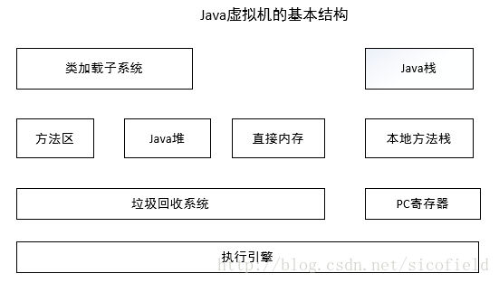

# Java

**如何理解面向对象？**

面向对象编程是一种编程范式，满足面向对象编程的语言，一般会提供类、封装、继承等语法和概念来辅助我们进行面向对象编程。

类型被设计为将数据和行为捆绑在一起的一种东西，数据和行为被称之为类型的成员。我们可以创建类型的实例，不同的实例包含不同的数据，从而其表现出来的行为也会不同，尽管其代码是一样的。

1. 继承：给对象提供了从基类获取字段和方法的能力。继承提供了代码的重用行，也可以在不修改类的情况下给现存的类添加新特性。
2. 封装：封装给对象提供了隐藏内部特性和行为的能力。对象提供一些能被其他对象访问的方法来改变它内部的数据。在 Java 当中，有 几种修饰符：确认，public， private 和 protected。每一种修饰符给其他的位于同一个包或者不同包下面对象赋予了不同的访问权限。下面列出了使用封装的一些好处：
   - 通过隐藏对象的属性来保护对象内部的状态。
   - 提高了代码的可用性和可维护性，因为对象的行为可以被单独的改变或者是扩展。
   - 禁止对象之间的不良交互提高模块化
3. 多态：允许不同类对象对同一消息做出响应，即同一消息可以根据发送对象的不同而采用多种不同的行为方式(发送消息就是函数调用)。好处是:
   - 可替换性：多态对已存在代码具有可替换性
   - 可扩充性：增加新的子类不影响已经存在的类结构
   - 接口性：多态是超类通过方法签名,向子类提供一个公共接口,由子类来完善或者重写它来实现的。

**面向对象和面向过程的区别？**

面向过程就是分析出解决问题所需要的步骤，然后用函数把这些步骤一步一步实现，使用的时候一个一个依次调用就可以了。面向对象是把构成问题事务分解成各个对象，建立对象的目的不是为了完成一个步骤，而是为了描叙某个事物在整个解决问题的步骤中的行为 。（+如何理解面向对象）

**代码中如何实现多态？**

1. 接口实现 
2. 继承父类重写方法 
3. 同一类中进行方法重载

**接口和抽象类的区别？**

| 比较       | 抽象类                                                       | 接口                                                      |
| ---------- | ------------------------------------------------------------ | --------------------------------------------------------- |
| 默认方法   | 有默认的方法实现                                             | java 8之前不存在方法的实现                                |
| 实现方式   | 子类使用extends关键字来继承抽象类.如果子类不是抽象类,子类需要提供抽象类中所声明方法的实现 | 子类使用implements来实现接口,需要提供接口中所有声明的实现 |
| 构造器     | 有                                                           | 没有                                                      |
| 实例化     | 不行                                                         | 不行                                                      |
| 访问修饰符 | 抽象方法可以有public,protected和default等修饰                | 接口默认是public                                          |
| 多继承     | 一个子类只能存在一个父类                                     | 一个子类可以存在多个接口                                  |
| 添加新方法 | 向抽象类中添加新方法,可以提供默认的实现,因此可以不修改子类现有的代码 | 往接口中添加新方法,则子类中需要实现该方法                 |

接口的设计目的，是对类的行为进行约束；

抽象类的设计目的，是代码复用；

**父类的静态方法能否被子类重写**

不能。重写只适用于实例方法,不能用于静态方法，而子类当中含有和父类相同签名的静态方法，我们一般称之为隐藏。

**什么是不可变对象**

不可变对象指对象一旦被创建，状态就不能再改变。任何修改都会创建一个新的对象，如 String、Integer及其它包装类

**静态变量和实例变量的区别?**

静态变量存储在方法区，属于类所有。实例变量存储在堆当中，其引用存在当前线程栈。

**switch中能否使用string做参数？**

在idk 1.7之前，switch只能支持byte, short, char, int或者其对应的封装类以及Enum类型。从idk 1.7之后switch开始支持String。不能用long。

**你对String对象的intern()熟悉么?**

intern()方法会首先从常量池中查找是否存在该常量值，如果常量池中不存在则现在常量池中创建，如果已经存在则直接返回。

**Object中有哪些公共方法？**

1. equals();
2. clone();
3. getClass();
4. notify(), notifyAll(), wait();
5. toString();

**a==b与a.equals(b)有什么区别？**

值类型（int,char,long,boolean等）都是用==判断相等性。对象引用的话，==判断引用所指的对象是否是同一个。equals是Object的成员函数，有些类会覆盖（override）这个方法，用于判断对象的等价性。例如String类，两个引用所指向的String都是”abc”，但可能出现他们实际对应的对象并不是同一个（和jvm实现方式有关），因此用==判断他们可能不相等，但用equals判断一定是相等的。

**`equals()`和`hashcode()`的联系**

hashCode是根类Obeject中的方法。默认情况下，Object中的hashCode() 返回对象的32位jvm内存地址。也就是说如果对象不重写该方法，则返回相应对象的32为JVM内存地址

如果两个对象根据equal()方法比较相等，那么调用这两个对象中任意一个对象的hashCode()方法必须产生相同的哈希值。
如果两个对象根据eqaul()方法比较不相等，那么产生的哈希值不一定相等(碰撞的情况下还是会相等的。)

将对象放入到集合中时，首先判断要放入对象的hashcode是否已经在集合中存在，不存在则直接放入集合。如果hashcode相等，然后通过equal()方法判断要放入对象与集合中的任意对象是否相等：如果equal()判断不相等，直接将该元素放入集合中，否则不放入。

**final, finalize和finally的不同之处？**

final 是一个修饰符，可以修饰变量、方法和类。如果 final 修饰变量，意味着该变量的值在初始化后不能被改变。

finalize 方法是在对象被回收之前调用的方法，给对象自己最后一个复活的机会，但是什么时候调用 finalize 没有保证。

finally 是一个关键字，与 try 和 catch 一起用于异常的处理。finally 块一定会被执行，无论在 try 块中是否有发生异常。

**static都有哪些用法？**

1. 静态变量和静态方法：被static所修饰的变量/方法都属于类的静态资源，为类实例所共享
2. 静态块：多用于初始化操作
3. 静态内部类
4. 静态导包：可以用来指定导入某个类中的静态资源，并且不需要使用类名

**final有哪些用法？**

1. 被final修饰的类不可以被继承 
2. 被final修饰的方法不可以被重写 
3. 被final修饰的变量不可以被改变。如果修饰引用，那么表示引用不可变，引用指向的内容可变。
4. 被final修饰的方法，JVM会尝试将其内联，以提高运行效率 
5. 被final修饰的常量，在编译阶段会存入常量池中。

**重载和重写的区别**

| 区别点 | 重载                               | 重写                                 |
| ------ | ---------------------------------- | ------------------------------------ |
| 定义   | 方法名称相同，参数的类型或个数不同 | 方法名称、参数类型和返回类型全部相同 |
| 权限   | 无要求                             | 被重写的方法不能拥有更严格的权限     |
| 范围   | 发生在一个类中                     | 发生在继承类中                       |

**List 和 Set 的区别？**

List,Set都是继承自Collection接口

List特点：元素**有放入顺序**，元素**可重复**，和数组类似，List可以动态增长，**查找元素效率高，插入删除元素效率低**，因为会引起其他元素位置改变。

Set特点：元素**无放入顺序**，元素**不可重复**，重复元素会覆盖掉，**检索元素效率低下，删除和插入效率高**，插入和删除不会引起元素位置改变。

（注意：元素虽然无放入顺序，但是元素在set中的位置是有该元素的HashCode决定的，其位置其实是固定的，加入Set 的Object必须定义equals()方法 ，另外list支持for循环，也就是通过**下标**来遍历，也可以用迭代器，但是set只能用迭代，因为他无序，无法用下标来取得想要的值。）

**List  和 Map 区别？**

List是对象集合，允许对象重复。

Map是键值对的集合，不允许key重复。

**ArrayList 和 LinkedList 的区别？**

**Arraylist：**

优点：ArrayList是实现了基于动态数组的数据结构,因为地址连续，一旦数据存储好了，查询操作效率会比较高（在内存里是连着放的）。

缺点：因为地址连续， ArrayList要移动数据,所以插入和删除操作效率比较低。

**LinkedList：**

优点：LinkedList基于链表的数据结构,地址是任意的，所以在开辟内存空间的时候不需要等一个连续的地址，对于新增和删除操作add和remove，LinedList比较占优势。LinkedList 适用于要头尾操作或插入指定位置的场景

缺点：因为LinkedList要移动指针,所以查询操作性能比较低。

**适用场景分析：**

当需要对数据进行对此访问的情况下选用ArrayList，当需要对数据进行多次增加删除修改时采用LinkedList。

**ArrayList 和 Vector 区别？**

ArrayList和Vector都是用数组实现的，主要有这么三个区别：

1. Vector是**多线程安全**的，线程安全就是说多线程访问同一代码，不会产生不确定的结果。而ArrayList不是，这个可以从源码中看出，Vector类中的方法很多有**synchronized**进行修饰，这样就导致了Vector在**效率**上无法与ArrayList相比；
2. 两个都是采用的线性连续空间存储元素，但是当空间不足的时候，两个类的增加方式是不同的。
3. Vector可以设置**增长因子**，而ArrayList不可以。（如果该增长因子指定了，那么扩容的时候会每次新的数组大小会在原数组的大小基础上加上增长因子；如果不指定增长因子，那么就给原数组大小*2）

适用场景分析：

1. Vector是线程同步的，所以它也是线程安全的，而ArrayList是线程异步的，是不安全的。如果不考虑到线程的安全因素，一般用ArrayList效率比较高。
2. 如果集合中的元素的数目大于目前集合数组的长度时，在集合中使用数据量比较大的数据，用Vector有一定的优势。（？）

**HashMap 和 Hashtable 的区别？**

1. **线程是否安全：** HashMap 是非线程安全的，HashTable 是线程安全的；HashTable 内部的方法基本都经过 `synchronized`修饰。（如果你要保证线程安全的话就使用 ConcurrentHashMap 吧！）；
2. **效率：** 因为线程安全的问题，HashMap 要比 HashTable 效率高一点。另外，HashTable 基本被淘汰，不要在代码中使用它；
3. **对Null key 和Null value的支持：** HashMap 中，null 可以作为键，这样的键只有一个，可以有一个或多个键所对应的值为 null。。但是在 HashTable 中 put 进的键值只要有一个 null，直接抛出 NullPointerException。
4. **初始容量大小和每次扩充容量大小的不同 ：** ①创建时如果不指定容量初始值，Hashtable 默认的初始大小为11，之后每次扩充，容量变为原来的2n+1。HashMap 默认的初始化大小为16。之后每次扩充，容量变为原来的2倍。②创建时如果给定了容量初始值，那么 Hashtable 会直接使用你给定的大小，而 HashMap 会将其扩充为2的幂次方大小（HashMap 中的`tableSizeFor()`方法保证，下面给出了源代码）。也就是说 HashMap 总是使用2的幂作为哈希表的大小,后面会介绍到为什么是2的幂次方。
5. **底层数据结构：** JDK1.8 以后的 HashMap 在解决哈希冲突时有了较大的变化，当链表长度大于阈值（默认为8）时，将链表转化为红黑树，以减少搜索时间。Hashtable 没有这样的机制。

**HashSet 和 HashMap 区别？**

set是**线性结构**，set中的值不能重复，hashset是set的hash实现，hashset中值不能重复是用**hashmap的key**来实现的。

map是**键值对**映射，可以空键空值。HashMap是Map接口的hash实现，key的唯一性是通过key值hash值的唯一来确定，value值是则是链表结构。

他们的共同点都是hash算法实现的唯一性，他们都不能持有基本类型，只能持有对象

**HashMap 和 ConcurrentHashMap 的区别？**

ConcurrentHashMap是线程安全的HashMap的实现。

（1）ConcurrentHashMap对整个桶数组进行了分割分段(Segment)，然后在每一个分段上都用lock锁进行保护，相对于HashTable的syn关键字锁的粒度更精细了一些，并发性能更好，而HashMap没有锁机制，不是线程安全的。

（2）HashMap的键值对允许有null，但是ConCurrentHashMap都不允许。

**CopyOnWriteArrayList？**

**定义：**当我们往一个容器添加元素的时候，不直接往当前容器添加，而是先将当前容器进行Copy，复制出一个新的容器，然后新的容器里添加元素，添加完元素之后，再将原容器的引用指向新的容器。这样做的好处是我们可以对CopyOnWrite容器进行并发的读，而不需要加锁，因为当前容器不会添加任何元素。所以CopyOnWrite容器也是一种读写分离的思想，读和写不同的容器。

**使用场景：**CopyOnWrite并发容器用于**读多写少**的并发场景。比如白名单，黑名单，商品类目的访问和更新场景。

**缺点：**

- 内存占用问题
- 数据一致性问题：只能保证数据的最终一致性，不能保证数据的实时一致性。所以如果你希望写入的的数据，马上能读到，请不要使用CopyOnWrite容器。

**类加载过程？**

JVM虚拟机把.class文件中类信息加载进内存，并进行解析生成对应的class对象的过程，过程为：加载-->链接(验证-->准备-->解析)-->初始化

1. 加载：把class字节码文件从各个来源通过类加载器装载入内存中
   - 字节码来源：包括从本地路径下编译生成的.class文件，从jar包中的.class文件，从远程网络，以及动态代理实时编译
   - 类加载器：一般包括启动类加载器，扩展类加载器，应用类加载器，以及用户的自定义类加载器（方便加密编译后的代码、允许从非标准来源加载代码）
2. 验证：保证加载进来的字节流符合虚拟机规范，不会造成安全错误
3. 准备：主要是为**类变量**（是static，不是实例变量，实例变量会在对象实例化时随着对象一块分配在Java堆中）分配内存，并且赋予初值
   - 初值不是代码中具体写的初始化的值，而是Java虚拟机根据不同变量类型的默认初始值（8种基本类型默认为0，引用类型的初值则为null，常量的初值即为代码中设置的值，final static tmp = 456， 那么该阶段tmp的初值就是456）
4. 解析：将常量池内的**符号引用**替换为**直接引用**，虚拟机会把所有的类名，方法名，字段名这些符号引用替换为具体的**内存地址或偏移量**，也就是直接引用。
5. 初始化：主要是对类变量初始化，是执行类构造器
   - 只对static修饰的变量或语句进行初始化
   - 如果初始化一个类的时候，其父类尚未初始化，则优先初始化其父类
   - 如果同时包含多个静态变量和静态代码块，则按照自上而下的顺序依次执行

**类加载器？**

站在Java虚拟机的角度来讲，只存在两种不同的类加载器：

- 启动类加载器：它使用C++实现（这里仅限于Hotspot，也就是JDK1.5之后默认的虚拟机，有很多其他的虚拟机是用Java语言实现的），是虚拟机自身的一部分。
- 所有其他的类加载器：这些类加载器都由Java语言实现，独立于虚拟机之外，并且全部继承自抽象类java.lang.ClassLoader，这些类加载器**需要由启动类加载器加载到内存中**之后才能去加载其他的类。

站在Java开发人员的角度来看，类加载器可以大致划分为以下三类：

- 启动类加载器：Bootstrap ClassLoader，跟上面相同。它负责加载存放在JDK\jre\lib(JDK代表JDK的安装目录，下同)下，或被-Xbootclasspath参数指定的路径中的，并且能被虚拟机识别的类库（如rt.jar，所有的java.*开头的类均被Bootstrap ClassLoader加载）。启动类加载器是无**法被Java程序直接引用**的。*
- *扩展类加载器：Extension ClassLoader，该加载器由sun.misc.Launcher$ExtClassLoader实现，它负责加载JDK\jre\lib\ext目录中，或者由java.ext.dirs系统变量指定的路径中的所有类库（如javax.*开头的类），开发者可以直接使用扩展类加载器。

- 应用程序类加载器：Application ClassLoader，该类加载器由sun.misc.Launcher$AppClassLoader来实现，它负责加载用户类路径（ClassPath）所指定的类，开发者可以直接使用该类加载器，如果应用程序中没有自定义过自己的类加载器，一般情况下这个就是程序中**默认的类加载器**。

**双亲委派模型：**自定义类加载器 -> 应用程序类加载器 -> 扩展类加载器 -> 启动类加载器

***双亲委派*流程：**如果一个类加载器收到了类加载的请求，它首先不会自己去尝试加载这个类，而是把请求**委托给父加载器**去完成，依次向上，因此，所有的类加载请求最终都应该被传递到顶层的启动类加载器中，只有当父加载器在它的搜索范围中**没有找到所需的类**时，即无法完成该加载，子加载器才会尝试自己去加载该类。

**优点：**有一个很明显的好处，就是Java类随着它的类加载器（说白了，就是它所在的目录）一起具备了一种带有**优先级的层次关系**，这对于保证Java程序的**稳定运作**很重要。例如，类java.lang.Object类存放在JDK\jre\lib下的rt.jar之中，因此无论是哪个类加载器要加载此类，最终都会委派给启动类加载器进行加载，这边保证了Object类在程序中的各种类加载器中都是同一个类。

**JVM基本结构**

- 类加载子系统：类加载子系统负责从文件系统或者网络中加载Class信息，加载的**类信息**存放于一块称为方法区的内存空间。方法区内有运行时常量池。

- 执行引擎：负责执行虚拟机的字节码
- 其它的关注：<https://juejin.im/entry/5a4ece456fb9a01ca6029670>

**volatile 和 synchronized 的区别？**

- volatile本质是在告诉jvm当前变量在寄存器（工作内存）中的值是不确定的，需要从主存中读取；synchronized则是锁定当前变量，只有当前线程可以访问该变量，其他线程被阻塞住。
- volatile仅能使用在**变量**级别；synchronized则可以使用在**变量、方法、和类级别**的
- volatile仅能实现变量的**修改可见性**，**不保证原子性**；而synchronized则可以保证变量的修改**可见性**和**原子性**
- volatile不会造成**线程**的阻塞；synchronized可能会造成线程的阻塞。
- volatile标记的变量不会被**编译器优化**；synchronized标记的变量可以被编译器优化

