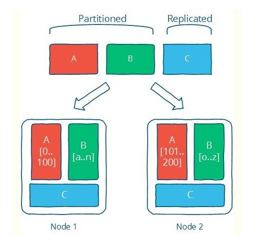

# 其它

**说说你对分布式的了解？**

**目的：**利用更多的机器，处理更多的数据

**内容：**分为分布式计算和分布式存储，分布式计算采用MapReduce的思想，具体实现是用分片(Partition)的方式，分布式存储是每个节点存一部分数据

**提高稳定性的做法：**分片Partition与复制集Replication，多个节点负责同一个任务

**CAP问题：**一个分布式系统最多只能同时满足一致性（Consistency）、可用性（Availability）和分区容错性（Partition tolerance）这三项中的两项

C：更新操作成功并返回客户端完成后，所有节点在同一时间的数据完全一致

A：每一个非故障的节点必须对每一个请求作出响应

P：分布式系统在遇到某节点或网络分区故障的时候，仍然能够对外提供满足一致性和可用性的服务

*参考：<https://segmentfault.com/a/1190000015795980>*

