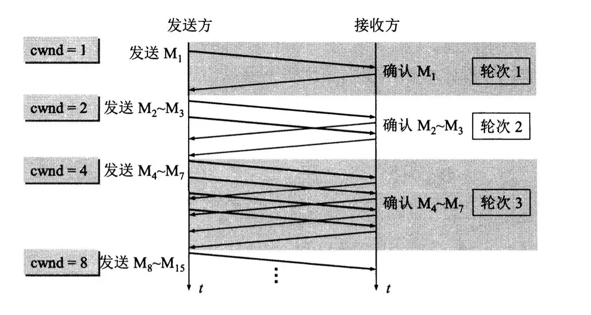
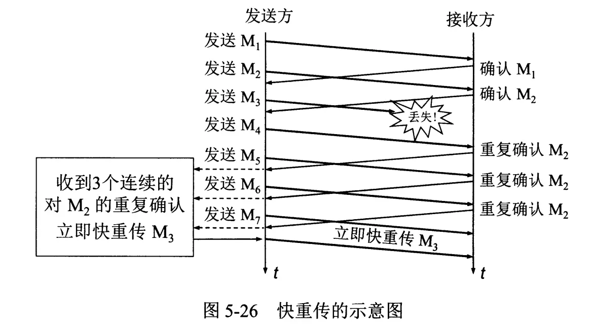
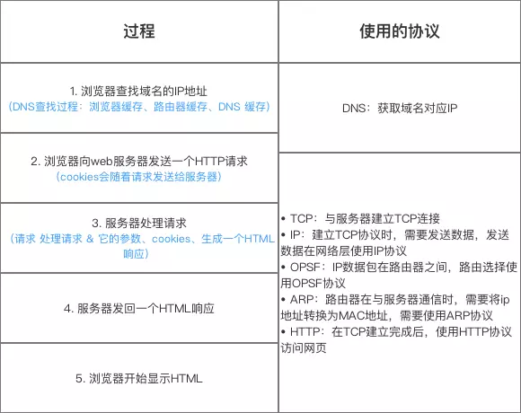
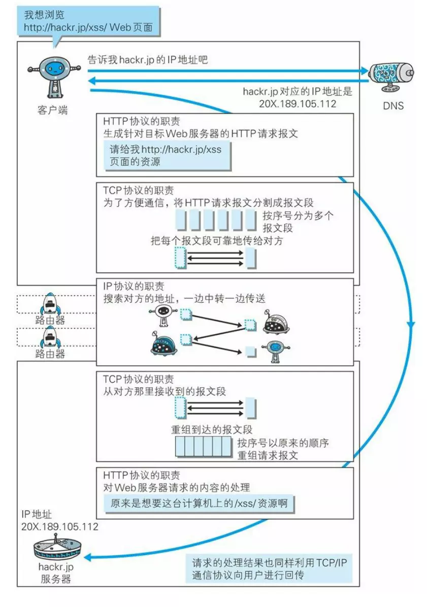
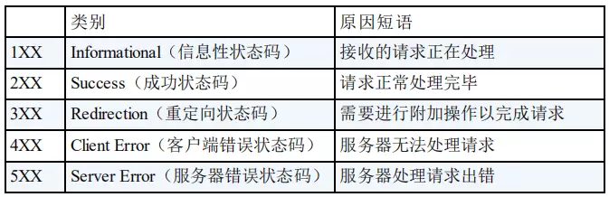

# 计网

## 运输层复用和分用

所谓复用就是指多个应用层进程可同时使用下面运输层的服务，分用和复用相反，是运输层把收到的信息分别交付上面应用层中的相应进程。

## OSI体系 TCP/IP体系 五层协议体系

**应用层：**应用层(application-layer）的任务是通过**应用进程间的交互**来完成特定网络应用。应用层协议定义的是应用进程（进程：主机中正在运行的程序）间的通信和交互的规则。对于不同的网络应用需要不同的应用层协议。

**运输层：**运输层(transport layer)的主要任务就是负责向两台**主机进程**之间的通信提供通用的数据传输服务。

**网络层：**网络层(network layer)负责为分组交换网上的不同主机提供通信服务。

**数据链路层：**数据链路层(data link layer)通常简称为链路层。两台主机之间的数据传输，总是在一段一段的链路上传送的，这就需要使用专门的链路层的协议。

**物理层：**在物理层上所传送的数据单位是比特。 物理层(physical layer)的作用是实现相邻计算机节点之间比特流的透明传送，尽可能屏蔽掉具体传输介质和物理设备的差异。 

## TCP三次握手与四次挥手

### 三次握手过程

三次握手的目的并不只是让通信双方都了解到一个连接正在建立，还在于利用数据包的选项来传输特殊的信息，交换初始序列号ISN

### ISN

三次握手的一个重要功能是客户端和服务端交换ISN(Initial Sequence Number), 以便让对方知道接下来接收数据的时候如何按序列号组装数据，ISN是动态随机的，目的是：

1. 为了增加安全性，为了避免被第三方猜测到，从而被第三方伪造的RST报文Reset（需要sequence number 位于对方的合法接收窗口内。 而由于ISN是动态随机的，猜出对方合法接收窗口难度加大。如果ISN = 0，那么猜出的难度就大大降低。）
2. 使得每个tcp session的字节序列号没有重叠，如果出现tcp五元组冲突这种极小概率情况的发生，一个session的数据也不会被误认为是另一个session的。

### SYN FLOOD攻击

最基本的DoS攻击就是利用**合理的服务请求**来占用过多的服务资源，从而使合法用户无法得到服务的响应。syn flood属于Dos攻击的一种。

如果恶意的向某个服务器端口发送大量的SYN包，则可以使服务器打开大量的**半开连接**，分配TCB（Transmission Control Block）, 从而消耗大量的服务器资源，同时也使得正常的连接请求无法被相应。当开放了一个TCP端口后，该端口就处于**Listening状态**，不停地监视发到该端口的Syn报文，一 旦接收到Client发来的Syn报文，就需要为该请求分配一个TCB，通常一个TCB至少需要280个字节，在某些操作系统中TCB甚至需要1300个字节，并返回一个SYN ACK命令，立即转为SYN-RECEIVED即**半开连接状态**。系统会为此耗尽资源。

### 三次握手的第一次可以携带数据吗，为何？

不可以，三次握手没有完成。第一次就携带数据会放大SYN FLOOD攻击。如果攻击者伪造了成千上万的握手报文，携带了1K+ 字节的数据，而接收方会开辟大量的缓存来容纳这些巨大数据，内存会很容易耗尽，从而拒绝服务。

### 四次挥手过程

### 为什么建立连接是三次握手，而关闭连接却是四次挥手呢？

这是因为服务端在LISTEN状态下，收到建立连接请求的SYN报文后，把ACK和SYN**放在一个报文里**发送给客户端。而关闭连接时，当收到对方的FIN报文时，仅仅表示对方不再发送数据了但是还能接收数据，己方是否现在关闭发送数据通道，需要上层应用来决定，因此，己方ACK和FIN一般都会**分开发送**。

## TCP、UDP 协议的区别

## TCP 协议如何保证可靠传输

1. TCP 给发送的每一个包进行**编号**，接收方对数据包进行**排序**，把有序数据传送给应用层。TCP 的接收端会**丢弃重复**的数据。
2. 校验和：TCP 将保持它**首部和数据**的检验和。这是一个端到端的检验和，目的是检测数据在传输过程中的任何变化。如果收到段的检验和有差错，TCP 将丢弃这个报文段和不确认收到此报文段。
3. **流量控制：**TCP 连接的每一方都有固定大小的缓冲空间，TCP的接收端只允许发送端发送接收端缓冲区能接纳的数据。当接收方来不及处理发送方的数据，能提示发送方降低发送的速率，防止包丢失。TCP 使用的流量控制协议是可变大小的滑动窗口协议。 （TCP 利用滑动窗口实现流量控制）
4. **拥塞控制：**当网络拥塞时，减少数据的发送。
5. **停止等待协议：**也是为了实现可靠传输的，它的基本原理就是每发完一个分组就停止发送，等待对方确认。在收到确认后再发下一个分组。 **超时重传：** 当 TCP 发出一个段后，它启动一个定时器，等待目的端确认收到这个报文段。如果不能及时收到一个确认，将重发这个报文段。

### 停止等待协议

- 停止等待协议是为了实现可靠传输的，它的基本原理就是每发完一个分组就停止发送，等待对方确认。在收到确认后再发下一个分组；
- 在停止等待协议中，若接收方收到重复分组，就丢弃该分组，但同时还要发送确认；

**无差错情况**

发送方发送分组,接收方在规定时间内收到,并且回复确认.发送方再次发送。

**出现差错情况（超时重传）**

停止等待协议中超时重传是指只要超过一段时间仍然没有收到确认，就重传前面发送过的分组（认为刚才发送过的分组丢失了）。因此每发送完一个分组需要设置一个超时计时器，其重转时间应比数据在分组传输的平均往返时间更长一些。这种自动重传方式常称为 **自动重传请求 ARQ** 。另外在停止等待协议中若收到重复分组，就丢弃该分组，但同时还要发送确认。**连续 ARQ 协议** 可提高信道利用率。发送维持一个发送窗口，凡位于发送窗口内的分组可连续发送出去，而不需要等待对方确认。接收方一般采用累积确认，对按序到达的最后一个分组发送确认，表明到这个分组位置的所有分组都已经正确收到了。

**确认丢失**

当A发送M1消息，B收到后，B向A发送了一个M1确认消息，但却在传输过程中丢失。而A并不知道，在超时计时过后，A重传M1消息，B再次收到该消息后采取以下两点措施：

1. 丢弃这个重复的M1消息，不向上层交付。
2. 向A发送确认消息。（不会认为已经发送过了，就不再发送。A能重传，就证明B的确认消息丢失）。

**确认迟到**

A发送M1消息，B收到并发送确认。在超时时间内没有收到确认消息，A重传M1消息，B仍然收到并继续发送确认消息（B收到了2份M1）。此时A收到了B第二次发送的确认消息。接着发送其他数据。过了一会，A收到了B第一次发送的对M1的确认消息（A也收到了2份确认消息）。处理如下：

1. A收到重复的确认后，直接丢弃。
2. B收到重复的M1后，也直接丢弃重复的M1。

### 自动重传 ARQ 协议

停止等待协议中超时重传是指只要超过一段时间仍然没有收到确认，就重传前面发送过的分组（认为刚才发送过的分组丢失了）。因此每发送完一个分组需要设置一个超时计时器，其重转时间应比数据在分组传输的平均往返时间更长一些。这种自动重传方式常称为自动重传请求ARQ。

**优点：** 简单
**缺点：** 信道利用率低

### 连续ARQ协议

连续 ARQ 协议可提高信道利用率。发送方维持一个发送窗口，凡位于发送窗口内的分组可以连续发送出去，而不需要等待对方确认。接收方一般采用累计确认，对按序到达的最后一个分组发送确认，表明到这个分组为止的所有分组都已经正确收到了。

**优点：** 信道利用率高，容易实现，即使确认丢失，也不必重传。

**缺点：** 不能向发送方反映出接收方已经正确收到的所有分组的信息。 比如：发送方发送了 5条 消息，中间第三条丢失（3号），这时接收方只能对前两个发送确认。发送方无法知道后三个分组的下落，而只好把后三个全部重传一次。这也叫 Go-Back-N（回退 N），表示需要退回来重传已经发送过的 N 个消息。

### 滑动窗口

- TCP 利用滑动窗口实现流量控制的机制。
- 滑动窗口（Sliding window）是一种流量控制技术。早期的网络通信中，通信双方不会考虑网络的拥挤情况直接发送数据。由于大家不知道网络拥塞状况，同时发送数据，导致中间节点阻塞掉包，谁也发不了数据，所以就有了滑动窗口机制来解决此问题。
- TCP 中采用滑动窗口来进行传输控制，滑动窗口的大小意味着接收方还有多大的缓冲区可以用于接收数据。发送方可以通过滑动窗口的大小来确定应该发送多少字节的数据。当滑动窗口为 0 时，发送方一般不能再发送数据报，但有两种情况除外，一种情况是可以发送紧急数据，例如，允许用户终止在远端机上的运行进程。另一种情况是发送方可以发送一个 1 字节的数据报来通知接收方重新声明它希望接收的下一字节及发送方的滑动窗口大小。

### 流量控制

- TCP 利用滑动窗口实现流量控制。
- 流量控制是为了控制发送方发送速率，保证接收方来得及接收。
- 接收方发送的确认报文中的窗口字段可以用来控制发送方窗口大小，从而影响发送方的发送速率。将窗口字段设置为 0，则发送方不能发送数据。

### 拥塞控制

在某段时间，若对网络中某一资源的需求超过了该资源所能提供的可用部分，网络的性能就要变坏。这种情况就叫拥塞。拥塞控制就是为了防止过多的数据注入到网络中，这样就可以使网络中的路由器或链路不致过载。拥塞控制所要做的都有一个前提，就是网络能够承受现有的网络负荷。拥塞控制是一个全局性的过程，涉及到所有的主机，所有的路由器，以及与降低网络传输性能有关的所有因素。相反，流量控制往往是点对点通信量的控制，是个端到端的问题。流量控制所要做到的就是抑制发送端发送数据的速率，以便使接收端来得及接收。

为了进行拥塞控制，TCP 发送方要维持一个 **拥塞窗口(cwnd)** 的状态变量。拥塞控制窗口的大小取决于网络的拥塞程度，并且动态变化。发送方让自己的发送窗口取为拥塞窗口和接收方的接受窗口中较小的一个。

TCP的拥塞控制采用了四种算法，即 **慢开始** 、 **拥塞避免** 、**快重传** 和 **快恢复**。在网络层也可以使路由器采用适当的分组丢弃策略（如主动队列管理 AQM），以减少网络拥塞的发生。

- **慢开始：** 慢开始算法的思路是当主机开始发送数据时，如果立即把大量数据字节注入到网络，那么可能会引起网络阻塞，因为现在还不知道网络的符合情况。经验表明，较好的方法是先探测一下，即由小到大逐渐增大发送窗口，也就是由小到大逐渐增大拥塞窗口数值。cwnd初始值为1，每经过一个传播轮次，cwnd加倍。

- **拥塞避免：** 拥塞避免算法的思路是让拥塞窗口cwnd缓慢增大，即每经过一个往返时间RTT就把发送放的cwnd加1。

- **快重传与快恢复：** 在 TCP/IP 中，快速重传和恢复（fast retransmit and recovery，FRR）是一种拥塞控制算法，它能快速恢复丢失的数据包。没有 FRR，如果数据包丢失了，TCP 将会使用定时器来要求传输暂停。在暂停的这段时间内，没有新的或复制的数据包被发送。有了 FRR，如果接收机接收到一个不按顺序的数据段，它会立即给发送机发送一个重复确认。如果发送机接收到三个重复确认，它会假定确认件指出的数据段丢失了，并立即重传这些丢失的数据段。有了 FRR，就不会因为重传时要求的暂停被耽误。  当有单独的数据包丢失时，快速重传和恢复（FRR）能最有效地工作。当有多个数据信息包在某一段很短的时间内丢失时，它则不能很有效地工作。

  

## 在浏览器中输入url地址过程

## 状态码

- 200 OK 
  请求正常处理完毕
- 204 No Content 
  请求成功处理，没有实体的主体返回
- 206 Partial Content 
  GET范围请求已成功处理
- 301 Moved Permanently 
  永久重定向，资源已永久分配新URI
- 302 Found 
  临时重定向，资源已临时分配新URI
- 303 See Other 
  临时重定向，期望使用GET定向获取
- 304 Not Modified 
  不是服务器发出的错误，是服务器所承载的业务系统在开发时为了节省带宽和提升浏览器的体验，对GET/js,css，image等执行了**缓存机制**。客户端第一次对服务器发出GET请求，客户端浏览器缓存了该页面，当客户端第二次对服务器发出同样的GET请求时，若客户端缓存中的`If-Modified-Since`过期，客户端将向服务器发出GET请求，验证`If-Modified-Since`和`If-None-Match`是否与web server中信息一致，如果Get页面未做任何修改，服务器就是对客户端返回304 Not Modified，客户端直接从本地缓存中将页面资源调取
- 307 Temporary Redirect 
  临时重定向，POST不会变成GET
- 400 Bad Request 
  请求报文语法错误或参数错误
- 401 Unauthorized 
  需要通过HTTP认证，或认证失败
- 403 Forbidden 
  请求资源被拒绝
- 404 Not Found 
  无法找到请求资源（服务器无理由拒绝）
- 500 Internal Server Error 
  服务器故障或Web应用故障
- 503 Service Unavailable 
  服务器超负载或停机维护

**路由器和交换机的区别？**

- 交换机工作在第二层，数据链路层；路由器工作在第三层，网络层。

- 在数据链路层只能识别物理地址，因此当交换机的某个端口收到一个数据帧时，交换机会读取数据帧中相应的目标地址的MAC地址，然后在自己的MAC地址表中查找是否有目标MAC地址的端口信息，如果有，则把数据帧转发到相应的端口；如果没有，则向除源端口外的所有端口进行转发。

- 当路由器的某个接口收到一个包时，路由器会读取包中相应目标的逻辑地址的网络部分，然后在路由表中进行查找。如果在路由表中找到了目标地址的路由条目，则把包转发到路由器的相应接口；如果在路由表中没有找到目标地址的路由条目，那么，如果路由器配置了默认路由，就根据默认路由的配置转发到路由器的相应接口；如果路由器中没有配置默认路由，则将该包丢弃，并返回不可达信息。

- 传统的交换机只能分割冲突域，不能分割广播域（子网）；而路由器可以分割广播域；

- 路由器提供了防火墙的服务：路由器仅仅转发特定地址的数据包，不传送不支持路由协议的数据包传送和未知目标网络数据包的传送，从而可以防止广播风暴。