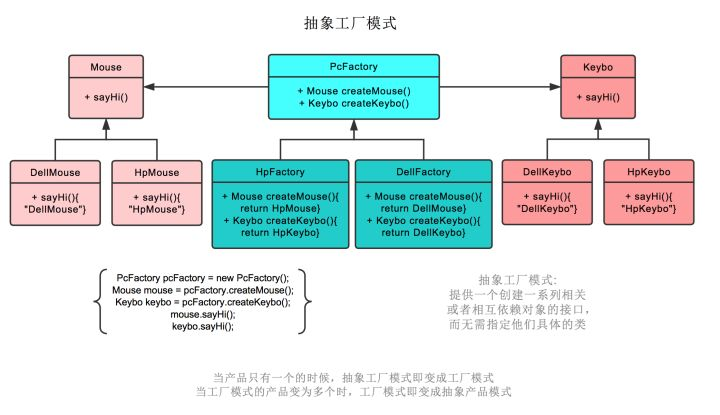

# 设计模式

## 分类

创建型：单例模式、简单工厂模式、工厂方法模式、抽象工厂模式

结构型：代理模式

行为型：观察者模式

## 介绍

### 单例模式

**定义：**保证一个类仅有一个实例，并提供一个访问它的全局访问点。

**结构图：**

**优点：**

- 实现了对唯一实例访问的可控
- 对于一些需要频繁创建和销毁的对象来说可以提高系统的性能

**缺点：**

- 不适用于变化的对象，如果同一类型的对象总是要在不同的用例场景发生变化，单例就会引起数据的错误，不能保存彼此的状态。
- 没有抽象层，不利于拓展
- 职责过重，违反单一职责原则

**使用场景：**

- 资源共享的情况下，避免由于资源操作时导致的性能或损耗等。如上述中的日志文件（一直处于打开状态，因为只能有一个实例去操作，否则内容不好追加），应用配置。
- 控制资源的情况下，方便资源之间的互相通信。如线程池等。

### 观察者模式

**定义：**定义了一种一对多的依赖关系，让多个观察者对象同时监听某一个主题对象。这个主题对象在状态变化时，会通知所有的观察者对象，使他们能够自动更新自己。

**结构：**

- Subject：抽象主题（抽象被观察者），抽象主题角色把所有观察者对象保存在一个集合里，每个主题都可以有任意数量的观察者，抽象主题提供一个接口，可以增加和删除观察者对象。
- ConcreteSubject：具体主题（具体被观察者），该角色将有关状态存入具体观察者对象，在具体主题的内部状态发生改变时，给所有注册过的观察者发送通知。
- Observer：抽象观察者，是观察者者的抽象类，它定义了一个更新接口，使得在得到主题更改通知时更新自己。
- ConcrereObserver：具体观察者，实现抽象观察者定义的更新接口，以便在得到主题更改通知时更新自身的状态。

**使用场景：**

- 关联行为场景，需要注意的是，关联行为是可拆分的，而不是“组合”关系。
- 事件多级触发场景。
- 跨系统的消息交换场景，如消息队列、事件总线的处理机制。

**优点：****解除耦合**，让耦合的双方都依赖于抽象，从而使得各自的变换都不会影响另一边的变换。

**缺点：**在应用观察者模式时需要考虑一下**开发效率**和**运行效率**的问题，程序中包括一个被观察者、多个观察者，开发、调试等内容会比较复杂，而且在Java中消息的通知一般是顺序执行，那么一个观察者卡顿，会影响整体的执行效率，在这种情况下，一般会采用异步实现。

### 代理模式

**定义：**为其他对象提供一种代理以控制这个对象的访问。（代购、打官司）

**结构：**

- Subject：抽象主题类，声明真实主题与代理的共同接口方法。
- RealSubject：真实主题类，定义了代理所表示的真实对象，客户端通过代理类间接的调用真实主题类的方法。
- ProxySubject：代理类，持有对真实主题类的引用，在其所实现的接口方法中调用真实主题类中相应的接口方法执行。
- Client：客户端类。

**实现：**代理类包含了真实主题类（被代理者），最终调用的都是真实主题类（被代理者）实现的方法

**类型：**

- 远程代理：为一个对象在不同的地址空间提供局部代表，这样系统可以将Server部分的事项**隐藏**。
- 虚拟代理：使用一个代理对象表示一个十分耗资源的对象并在真正需要时才创建。
- 安全代理：用来控制真实对象访问时的**权限**。
- 智能指引：当调用真实的对象时，代理处理另外一些事，比如计算真实对象的**引用计数**，当该对象没有引用时，可以自动释放它；或者访问一个实际对象时，检查是否已经能够锁定它，以确保其他对象不能改变它。

**使用场景：**无法或者不想直接访问某个对象时可以通过一个代理对象来间接的访问。

### 简单工厂模式

**定义：**定义一个类用来负责创建其他类的实例，被创建的实例通常都具有共同的父类

**结构：**

**优点：**

- 使用户根据参数获得对应的类实例，避免了直接实例化类，降低了耦合性。

**缺点：**

- 工厂类集中了所有实例（产品）的创建逻辑，一旦这个工厂不能正常工作，整个系统都会受到影响；
- 违背“开放 - 关闭原则”，一旦添加新产品就不得不修改工厂类的逻辑，这样就会造成工厂逻辑过于复杂。
- 简单工厂模式由于使用了静态工厂方法，静态方法不能被继承和重写，会造成工厂角色无法形成基于继承的等级结构。

**使用场景：**

- 工厂类负责创建的对象比较少。
- 客户只知道传入工厂类的参数，对于如何创建对象（逻辑）不关心。

### 工厂方法模式

**定义：**定义一个用于创建对象的接口，让子类决定实例化哪一个类，使一个类的实例化延迟到其子类

**结构：**

**优点：**

- 更符合开-闭原则 ，新增一种产品时，只需要增加相应的具体产品类和相应的工厂子类即可
- 符合单一职责原则 ，每个具体工厂类只负责创建对应的产品
- 不使用静态工厂方法，可以形成基于继承的等级结构

**缺点：**

- 添加新产品时，除了增加新产品类外，还要提供与之对应的具体工厂类，系统类的个数将成对增加，在一定程度上增加了系统的复杂度；同时，有更多的类需要编译和运行，会给系统带来一些额外的开销；
- 由于考虑到系统的可扩展性，需要引入抽象层，在客户端代码中均使用抽象层进行定义，增加了系统的抽象性和理解难度，且在实现时可能需要用到DOM、反射等技术，增加了系统的实现难度。
- 虽然保证了工厂方法内的对修改关闭，但对于使用工厂方法的类，如果要更换另外一种产品，仍然需要修改实例化的具体工厂类；
- 一个具体工厂只能创建一种具体产品

**使用场景：**

- 当一个类不知道它所需要的对象的类时。在工厂方法模式中，客户端不需要知道具体产品类的类名，只需要知道所对应的工厂即可；
- 当一个类希望通过其子类来指定创建对象时。在工厂方法模式中，对于抽象工厂类只需要提供一个创建产品的接口，而由其子类来确定具体要创建的对象，利用面向对象的多态性和里氏代换原则，在程序运行时，子类对象将覆盖父类对象，从而使得系统更容易扩展。
- 将创建对象的任务委托给多个工厂子类中的某一个，客户端在使用时可以无须关心是哪一个工厂子类创建产品子类，需要时再动态指定，可将具体工厂类的类名存储在配置文件或数据库中。

### 抽象工厂模式

**定义：**提供一个创建一系列相关或者相互依赖对象的接口，则无需指定他们具体的类

**结构：**

**优点：**具体类的创建实例过程与客户端分离，客户端通过工厂的抽象接口操纵实例，客户端并不知道具体的实现是谁。

**缺点：**如果增加新的产品族则也需要修改抽象工厂和所有的具体工厂。

**使用场景：**

- 一个系统不依赖于产品线实例如何被创建、组合和表达的细节。
- 系统中有多于一个的产品线，而每次只使用其中某一产品线。
- 一个产品线（或是一组没有任何关系的对象）拥有相同的约束。

**注意：**当产品只有一个的时候，抽象工厂模式即变成工厂模式，当工厂模式的产品变成多个时，工厂模式即变成抽象工厂模式